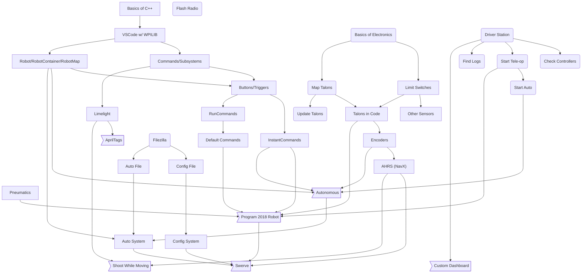

# 2023trainingrep

```mermaid
flowchart TB;

A[Basics of C++]
B[VSCode w/ WPILIB]; A --> B
C[Commands/Subsystems]; B --> C
D[Robot/RobotContainer/RobotMap]; B --> D
E[Buttons/Triggers]; C --> E; D --> E
G[InstantCommands]; E --> G
H[RunCommands]; E --> H
F[Default Commands]; H --> F

I(Basics of Electronics)
L[Limit Switches]; I ---> L
O[Other Sensors]; L --> O
P[Encoders]; Q --> P
R["AHRS (NavX)"]; P --> R

J(Map Talons); I ---> J
Q[Talons in Code]; J --> Q; L --> Q
K(Update Talons); J --> K

i(Driver Station)
M(Check Controllers); i --> M
N(Start Tele-op); i --> N
Y(Start Auto); N --> Y
Z(Find Logs); i --> Z

a[Limelight]; C ---> a
g>AprilTags]; a --> g

S(Filezilla)
T[Config File]; S --> T
U[Auto File]; S --> U

e[Pneumatics]
V>Program 2018 Robot]; e --> V; G ----> V; F ----> V; Q ----> V; N ------> V

W(Flash Radio)
X>Autonomous]; D ---> X; G ---> X; P ---> X; Y -----> X

b[Config System]; T ----> b
c[Auto System]; U ----> c; D --------> c; X --> c
d>Swerve]; b --> d; c --> d; R -----> d; V ---> d

f>Shoot While Moving]; R -----> f; a -------> f
h>Custom Dashboard]; i ----------> h

```