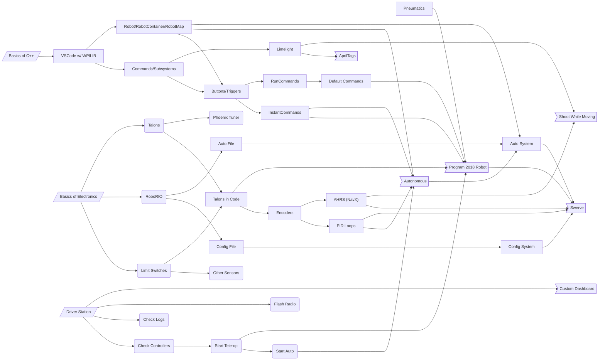
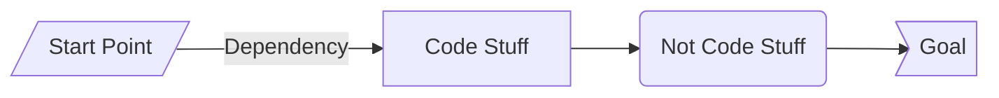
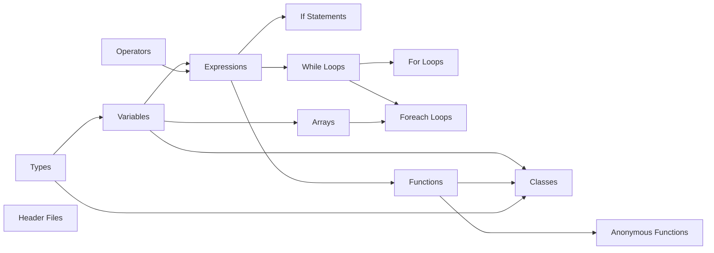

# 2023 Training Plan

This is our current teaching plan for programming/electronics, as a dependency chart.

```mermaid
flowchart LR;

classDef finished stroke:#0f0

A[/Basics of C++/]
B[VSCode w/ WPILIB]; A --> B
C[Commands/Subsystems]; B --> C
D[Robot/RobotContainer/RobotMap]; B --> D
E[Buttons/Triggers]; C --> E; D --> E
G[InstantCommands]; E --> G
H[RunCommands]; E --> H
F[Default Commands]; H --> F

I[/Basics of Electronics/]
L(Limit Switches); I --> L
O(Other Sensors); L --> O
P[Encoders]; Q --> P
j[PID Loops]; P --> j
R["AHRS (NavX)"]; P --> R
k(RoboRIO); I --> k

J(Talons); I --> J
Q[Talons in Code]; J --> Q; L --> Q
K(Phoenix Tuner); J --> K

i[/Driver Station/]
M(Check Controllers); i --> M
N(Start Tele-op); M --> N
Y(Start Auto); N --> Y
Z(Check Logs); i --> Z
W(Flash Radio); i ----> W

a[Limelight]; C ---> a
g>AprilTags]; a --> g

T[Config File]; k --> T
U[Auto File]; k --> U

e[Pneumatics]
V>Program 2018 Robot]; e --> V; G -----> V; F ----> V; Q ------> V; N -----> V

X>Autonomous]; D ---> X; G ----> X; j ---> X; Y ----> X

b[Config System]; T -------> b
c[Auto System]; U -------> c; D --------> c; X --> c
d>Swerve]; b --> d; c --> d; j ------> d; R ------> d; V ---> d

f>Shoot While Moving]; R ------> f; a -------> f
h>Custom Dashboard]; i ----------> h
```

## Legend

```mermaid
flowchart LR;

A[/Start Point/] -->|Dependency| B[Code Stuff] --> C(Not Code Stuff) --> D>Goal]
```

## Basics of C++

```mermaid
flowchart LR;

G[Types]
A[Variables]; G-->A
M[Operators]
B[Expressions]; A-->B; M-->B
K[If Statements]; B-->K
C[While Loops]; B-->C
D[For Loops]; C-->D
H[Arrays]; A-->H
I[Foreach Loops]; C-->I; H-->I 
E[Functions]; B--->E
F[Classes]; A----->F; E--->F; G------>F
J[Header Files]
L[Anonymous Functions]; E---->L
```